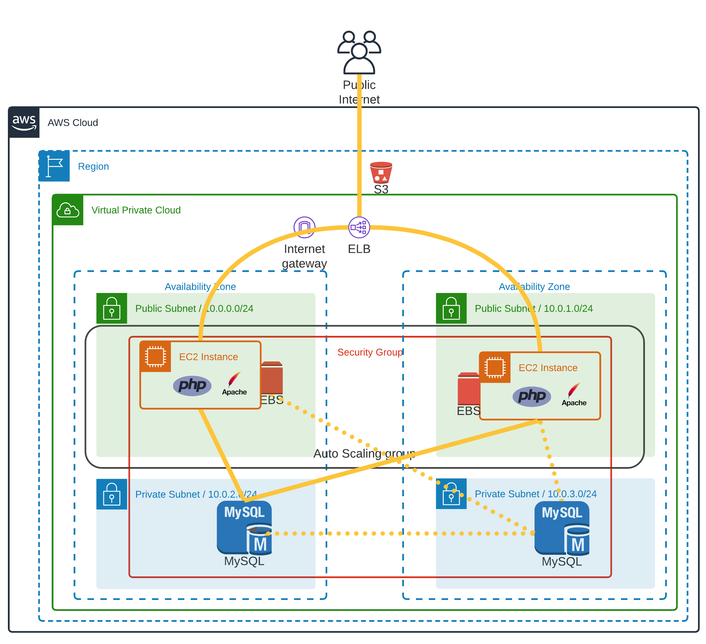

# Instructions for AWS Lampstack


Note: The S3 bucket depicted isn't created, as is not necessary for the LAMP config.

This will stand up an autoscaling group with 2 servers minimum. These servers will have Apache, PHP installed on them, with EBS storage. This will will also stand up MySQL instance with read-replica in a separate AZ.

There is a script that will be installed named `calldb.php` that will faciliate and show connection to MySQL.

## Requirements
* Terraform 0.15.0 was used for this recipe. I highly recommend installing `tfswitch` via brew (or your package manager of choice).
* OpenSSL utility (should be a part of Mac/Linux).
* Curl utility (should be a part of Mac/Linux).
* AWS CLI installed
NOTE: Instructions work fine for Macos. Adjust things to Windows, if you need it.

## Preliminaries
* Generate new key for login:
```
ssh-keygen -t rsa -f ./sshkey
```
* Login to AWS CLI
```
rm  -rf ~/.aws/credentials
aws configure
```
* Get the latest AMI image ID that we'll use:
```
aws ssm get-parameters --names /aws/service/ami-amazon-linux-latest/amzn2-ami-hvm-x86_64-ebs --region $TF_VAR_REGION | jq -r '.Parameters[].Value'
```
* Generate random string for use in infra for Globally unique IDs: `openssl rand -hex 6` Note, copy part of the string starting with a letter. Use this in the next step.

* Create .env file
```
#!/bin/bash
export TF_VAR_REGION="us-east-1"
export TF_VAR_BUCKET_NAME="tfstate-<your random string>-lamp" 
export TF_VAR_BUCKET_KEY="tfstate"
export TF_VAR_PROJECT="Lamp_Example"
export TF_VAR_AMI_ID="ami-01fbb4d2e4383c997"
export TF_VAR_DB_USER="foo" #whatever here
export TF_VAR_DB_PASSWORD="foobarbaz" #whatever here
```
* Source this in a terminal window with `source .env`
* Create S3 bucket for TF State.
```
 aws s3api  create-bucket --bucket $TF_VAR_BUCKET_NAME --region $TF_VAR_REGION
```

## Terraform work
* Init the Terraform backend state.
```
terraform init --backend-config "bucket=$TF_VAR_BUCKET_NAME" --backend-config "key=$TF_VAR_BUCKET_KEY" --backend-config "region=$TF_VAR_REGION"
```
* Plan:
```
terraform plan
```
* Execute.
```
terraform apply -auto-approve
```
## Test it
* *Note: wait about 5 minutes, due to DNS propagation*

* Execute the following over and over to see the 2 EC2's answering:
```
curl $(eval echo `terraform output elb_dns_name`)/index.php
```
* Execute the following over and over to see the database usage of RDS
```
curl $(eval echo `terraform output elb_dns_name`)/calldb.php
```
## Destroy things
* To remove everything: `terraform destroy -auto-approve`

